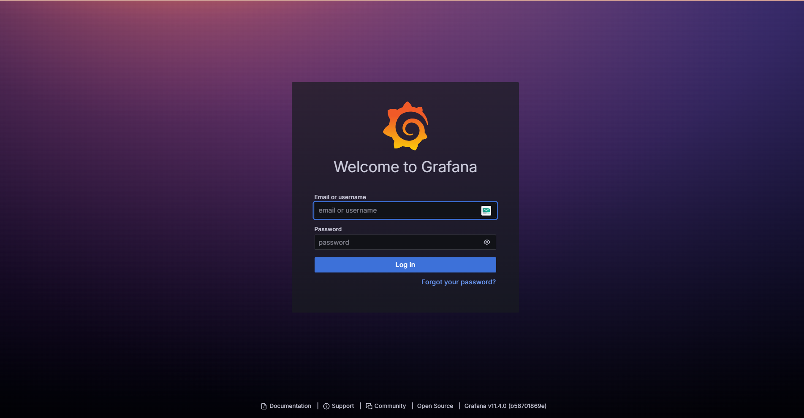
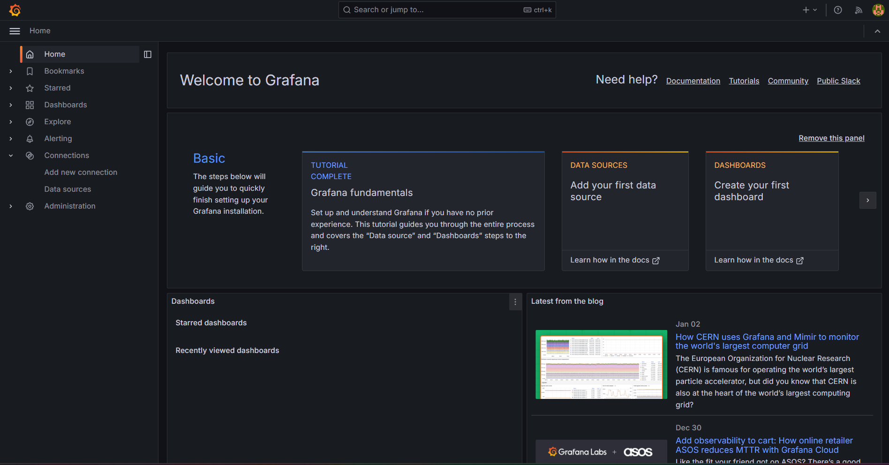
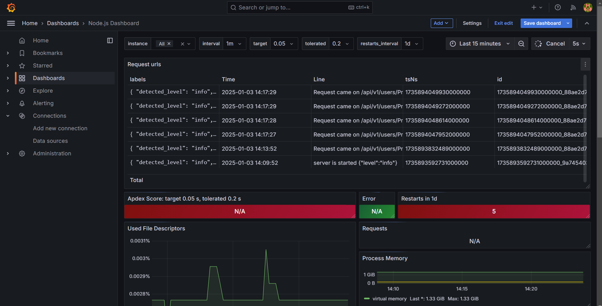
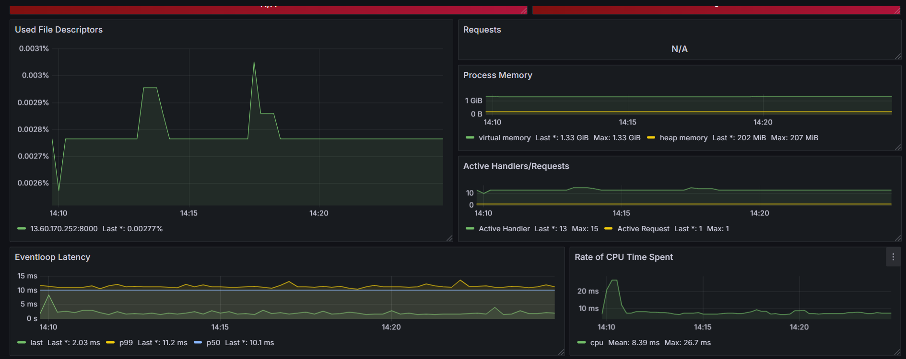

# Node.js Server Project with CI/CD and Continuous Monitoring Setup

This readme provides only a comprehensive setup for a Node.js server integrated with CI/CD pipelines, logging, and monitoring using Prometheus, Grafana, and Loki. **Note:** This setup is specifically designed for CI/CD and DevOps purposes , see this only after pushing your server in github and add babel or realted module for build script.

---

## **Prerequisites**

- Node.js (v20 or later)
- AWS account for EC2 setup
- GitHub repository with necessary secrets configured
---

## Steps

### Step 1: Initialize the Node.js Project

- Create a Node.js project with all routes and necessary packages
- Install the addtional dependencies for metrics and log collection:
  ```bash
  npm install winston winston-loki prom-client 
  ```

---

### Step 2: Sensitive Information Management

- Use a `.env` file to manage sensitive information like MongoDB URL, port numbers, and credentials.
- Example `.env` file:
  ```
  PORT=<your_port_number>
  DB_URL=<your_mongodb_url>
  Cross_origin=<your_origin>
  JWT_SECRET=<your_secret>
  LOKI_HOST=http://<your_system_IP>:3100
  ```
  **: note the second step is for the local running and to know the environment variables inside this project**
---

### Step 3: Adding Monitoring with Prometheus

-  Prometheus client in your Node.js project:
  
- Add a route for Prometheus metrics collection:
  ```javascript
  const express = require('express');
  const client = require('prom-client');

  const collectDefaultMetrics = client.collectDefaultMetrics;
  collectDefaultMetrics({ register: client.register });

  const app = express();

  app.get('/metrics', async (req, res) => {
    res.setHeader('Content-Type', client.register.contentType);
    const metrics = await client.register.metrics();
    return res.send(metrics);
  });
  ```
- the above one is example
---

### Step 4: Adding Logging with Loki

- Configure Winston with Loki for log management:
  ```javascript
  const { createLogger, transports, format } = require('winston');
  const LokiTransport = require('winston-loki');

  require('dotenv').config();

  const options = {
    level: 'info',
    format: format.combine(format.timestamp(), format.simple()),
    transports: [
      new LokiTransport({
        host: process.env.LOKI_HOST,
        labels: { job: 'my-server' },
      }),
      new transports.Console({
        format: format.combine(format.colorize(), format.simple()),
      }),
    ],
  };

  const logger = createLogger(options);
  logger.info('Server started');
  ```

- Add `logger.info` to every route for better log tracking:
  ```javascript
  logger.info('Request received on /api/v1/user/address');
  ```
- the above one is example one ; feel free to modify according to your needs.
---

### Step 5: Docker Setup

- Create a `Dockerfile` for containerization :
  ```dockerfile
  FROM node:20
  WORKDIR /app
  COPY package*.json ./
  RUN npm install
  COPY . .
  RUN npm run build
  EXPOSE ${PORT}
  ENV PORT=${PORT}
  ENV DB_URL=${DB_URL}
  ENV CROSS_ORIGIN=${CROSS_ORIGIN}
  ENV JWT_SECRET=${JWT_SECRET}
  ENV LOKI_HOST=${LOKI_HOST}
  CMD ["node", "dist/index.js"]
  ```

- Build and run the Docker container:
  ```bash
  docker build -t <image_name> .
  docker run -p <host_port>:<container_port> <image_name>
  ```

---
### Step 6: Add your environment variables in your Github Secrets
- navigate to 
  `settings of project > environments > create new environment > add environment variables as secrets`
### Step 7: GitHub Actions Workflow

- Add a CI/CD workflow file in the below is example: `.github/workflows/<filename>.yaml`:
  ```yaml
  name: Node.js CI

  on:
    push:
      branches:
        - main
    pull_request:
      branches:
        - main

  jobs:
    build:
      runs-on: ubuntu-latest
      environment: production_env
      strategy:
        matrix:
          os: [ubuntu-latest]
          node-version: [20.x]
      steps:
        - name: Checkout code
          uses: actions/checkout@v4

      - name: Use Node.js ${{ matrix.node-version }}
        uses: actions/setup-node@v4
        with:
          node-version: ${{ matrix.node-version }}
          cache: 'npm'

      - name: Install dependencies
        run: npm install

      - name: Build code
        run: npm run build --if-present

      - name: Login to Docker
        uses: docker/login-action@v2
        with:
          username: ${{ secrets.DOCKER_USERNAME }}
          password: ${{ secrets.DOCKER_PASSWORD }}

      - name: Build and tag Docker image
        run: docker build -t ${{ secrets.DOCKER_USERNAME }}/<image_name>:latest .

      - name: Push Docker image
        run: docker push ${{ secrets.DOCKER_USERNAME }}/nodejs-envanto:latest

  deploy:
    needs: build
    runs-on: self-hosted
    environment: production_env
    steps:
      - name: Pull the image from Docker Hub
        run: docker pull ${{ secrets.DOCKER_USERNAME }}/<your_image_name>:latest

      - name: Remove previous container (if exists)
        run: docker rm -f my-server || true

      - name: Run the pulled image
        run: |
          docker run -d \
          --name my-server \
          -p ${{ secrets.PORT }}:8000 \
          -e PORT=${{ secrets.PORT }} \
          -e LOKI_HOST=${{ secrets.LOKI_HOST }} \
          -e DB_URL=${{ secrets.DB_URL }} \
          -e CROSS_ORIGIN=${{ secrets.CROSS_ORIGIN }} \
          -e JWT_SECRET=${{ secrets.JWT_SECRET }} \
          ${{ secrets.DOCKER_USERNAME }}/<your_image_name>:latest

  ```

---

### Step 8: EC2 Instance Setup

- Launch an Ubuntu EC2 instance.
- Configure security group to allow HTTP, HTTPS, and custom TCP ports for Prometheus (9090), Grafana (3000), and Loki (3100).
1. Launch an EC2 Instance

- Give your desired name to your EC2 instance.
- Select "Ubuntu" as your operating system.
- Choose a free-tier eligible Amazon Machine Image (AMI) that matches your desired Ubuntu version.
- Choose an instance type that is free-tier eligible:
  - Select "t3.micro" or "t2.micro".
- If you have a key pair:
  - Select the existing key pair.
- If you don’t have a key pair:
  - Proceed with no key pair selected.
- Do not make any changes in the Network settings; leave them as default.
- Check the following boxes:
  1. Allow HTTPS traffic from the internet.
  2. Allow HTTP traffic from the internet.
- Do not change anything in the Configure Storage section.
- Review your selections and click Launch to create your instance.

---

2. Configure Security Group

- Navigate to your EC2 Dashboard and select your newly launched instance.
- Click on Security and then Security Groups.
- Click on Edit inbound rules.
- In the Type dropdown, select Custom TCP.
- Set the Port Range to the specific ports for your services.
- Set the Source (CIDR Block) to 0.0.0.0/0 to allow traffic from anywhere.
- Add the following ports to allow traffic for each service:
  - Port 3100 for Loki.
  - Port 3000 for Grafana.
  - Port 9090 for Prometheus.
  - Port <your server port> for your server.

---

3. Connect to the EC2 Instance

- Click on the Connect button for your EC2 instance.
- Choose EC2 Instance Connect and click Connect to access your instance via SSH.

---

### Step 8: Prometheus Setup

- Download and configure Prometheus:
  ```bash
  wget https://github.com/prometheus/prometheus/releases/download/v2.53.3/prometheus-2.53.3.linux-amd64.tar.gz
  tar -xvzf prometheus-2.53.3.linux-amd64.tar.gz
  cd prometheus-2.53.3.linux-amd64
  ```

- Update `prometheus.yml` with your metrics path:
```bash
nano prometheus.yml
```
```yaml
scrape_configs:
  - job_name: 'nodejs-app'
    static_configs:
      - targets: ['<ec2_ip>:8000']
    metrics_path: '/metrics'
```
  `ctrl+o > hit enter > ctrl+x`

---

### Step 9:
-Run Prometheus server in another screen
```bash
screen -S prometheus
```
```bash
./prometheus
```
- `ctrl+A  then d`
  
### Step 10: Grafana and Loki Setup

- Run Grafana and Loki containers:
  1. For Grafana  
  ```bash
  docker run -d -p 3000:3000 --name=grafana grafana/grafana-oss
  ```
  2. For Loki
  ```bash
  docker run -d -p 3100:3100 --name=loki grafana/loki
  ```
- To get all the current running conatiners.
  ```bash
  docker ps
  ```
---

### Step 10: Visualizations

Now, in a new tab, navigate to `http://<your_ec2_ip>:9090` to check if Prometheus is running.
- Click on **Status > Targets**.
- You should see your URL in **blue color** (this indicates the correct path for metrics).

In a new tab, navigate to `http://<your_ec2_ip>:3000` for Grafana. You will get the authentication page:

- Username: `admin`
- Password: `admin`
- You can change the password or skip it.

Navigate to **Data Sources** in **Connections** > **Add New Data Source**.

- Select **Loki**.
- Add the Loki URL (e.g., `http://<your_ec2_ip>:3100/`).
- Scroll down and click **Save & Test**.

Navigate to **Dashboard** > **New Dashboard** > **Add Visualization**.
- Select **Prometheus** as the data source.
- Choose the metrics and run queries to get the graphs.

Click **Edit** > **Add Visualization** > **Data Source** > **Prometheus**.
- Select the **labels** and **values**.

Now, back to the **Dashboard**.


---

## Images

- **Grafana Dashboards**
  
  

---

## Notes

This setup is intended for **CI/CD and DevOps** use cases only. Ensure your environment variables are securely managed and your infrastructure is properly secured.

---
